# 90 分钟一口气搞懂人工智能和神经网络

> 课程对象：零基础学习者  
> 对应视频：漫士沉思录《90分钟深度！一口气看明白人工智能和神经网络》  
> 视频基准：作者 B 站同版 `BV1atCRYsE7x`，88:58  
> 使用方法：按顺序学习。每章末尾先回答“检查点”，再进入下一章。

---

## 课程目标

学完后，你应该能够不用堆术语，沿着一条完整因果链解释：

1. 人工智能为什么可以理解成“输入到输出的函数”。
2. 符号主义、机器学习和联结主义分别怎样制造智能。
3. 感知机为什么能分类，又为什么解决不了 XOR。
4. 多层神经网络为什么更强，模型又是如何从数据中学会参数的。
5. 损失函数、梯度下降和反向传播分别负责什么。
6. 泛化为什么让 AI 有用，相关性学习又为什么会带来错误。
7. GPT 如何通过预测下一个 Token 学会生成语言。
8. 扩散模型如何从随机噪声生成图片和视频。
9. AI 更容易替代什么任务，人应怎样与 AI 协作。

## 原片学习地图

```text
什么是智能
  ↓
输入 → 黑箱函数 → 输出
  ↓
符号规则不够灵活，于是让机器从数据中学习
  ↓
感知机 → XOR 困境 → 多层神经网络
  ↓
损失函数定义“好坏”
  ↓
反向传播算梯度，梯度下降改参数
  ↓
模型学到规律并泛化
  ↓
GPT：学习语言数据中的规律
  ↓
扩散模型：学习图像数据中的规律
  ↓
能力、局限与工作变化
```

---

# 第一部分：人工智能到底在造什么

## 第 1 章 从达特茅斯会议开始

**原片时间：00:50-01:47**

1956 年，约翰·麦卡锡、马文·闵斯基、克劳德·香农、纳撒尼尔·罗切斯特等研究者齐聚达特茅斯。他们提出一个野心很大的问题：

> 能否制造一台会学习、会推理、会表现出智能的机器？

这次会议通常被视为“人工智能”作为研究领域的起点。后来出现的 AlphaGo、GPT、图像生成模型，采用的技术路线各不相同，但都在回答同一个问题：**怎样用人工系统实现原本需要智能才能完成的任务？**

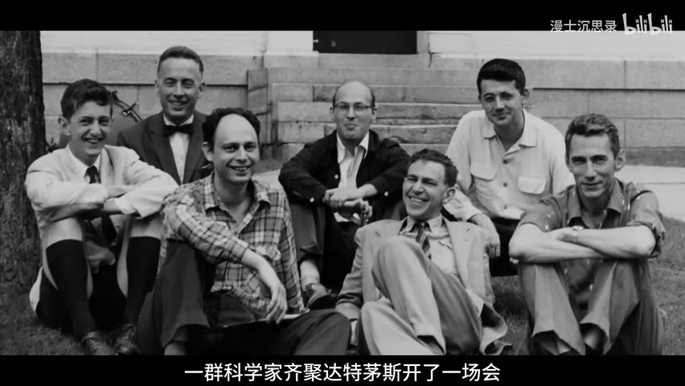

*图 1：作者同版视频 00:53。*

### 检查点

人工智能研究的核心目标不是“做一台外形像人的机器”，而是让系统具备什么能力？

> 参考答案：针对不同环境和输入，给出合适的判断、预测、语言或动作。

---

## 第 2 章 智能是输入到输出的函数

**原片时间：01:47-05:46**

先观察几种反应：

- 你让狗坐下，它可能执行指令。
- 草履虫会靠近营养物，避开有害刺激。
- 石头不会根据你的语言改变行为。

这些例子粗糙但抓住了共同点：**智能系统会收集信息，并根据情境做出有针对性的反应。**

把它写成数学形式：

$$
y=f(x)
$$

- $x$ 是情境或输入，例如人脸像素、棋盘状态、上文。
- $f$ 是系统内部的“黑箱”。
- $y$ 是输出，例如身份、下一步棋、回答。

于是：

- 人脸识别：人脸图片 $\rightarrow$ 身份。
- AlphaGo：棋局状态 $\rightarrow$ 落子。
- GPT：上文与问题 $\rightarrow$ 后续 Token。

如果系统无论输入什么都输出同一个结果，它虽然也有一个函数，却没有完成目标。真正有用的“智能函数”必须捕捉任务规律。

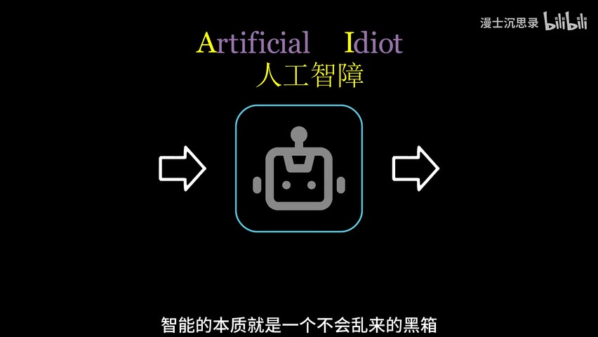

*图 2：作者同版视频 04:11。*

### 图灵测试在这条路线中的位置

图灵测试不要求我们打开机器检查它是否“真的像人一样思考”，而是观察交互输出。如果在对话中无法区分人和机器，至少从外部行为看，这个系统实现了接近人的输入输出关系。

### 本章结论

> AI 的工程问题，可以先被压缩成：选择什么输入、想要什么输出，以及怎样找到中间的函数。

### 检查点

把“垃圾邮件识别”写成 $y=f(x)$：$x$、$y$ 分别是什么？

> 参考答案：$x$ 可以是邮件文字、发件人和链接等特征；$y$ 是“垃圾邮件/正常邮件”的分类或概率。

---

# 第二部分：三条制造智能的路线

## 第 3 章 符号主义：把知识写成规则

**原片时间：05:46-08:01**

第一种直觉是：人会推理，那么把推理规则写进机器就行。

例如：

```text
A：阴天
B：湿度大于 70%
T：将要下雨

规则：如果 A 且 B，那么 T
```

系统保存大量符号、事实和“如果……那么……”规则，再通过逻辑推演得到结论。这就是**符号主义**。专家系统是它的典型产物：把医生或金融专家的知识写成规则库，系统据此诊断或给出建议。

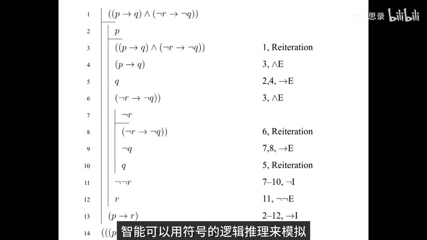

*图 3：作者同版视频 05:59。*

### 为什么专家系统遇到瓶颈

1. **规则难以穷举**：真实世界充满模糊情况。
2. **专家可能冲突**：同一症状，不同专家判断不同。
3. **维护成本高**：新情况出现后，要人工补规则。
4. **能力上限明显**：系统主要复制已有知识，很难自动超过知识提供者。

符号主义并没有消失。数据库规则、形式验证、知识图谱和业务规则引擎仍然重要。问题只在于：**它不适合独自承包所有智能。**

### 检查点

哪类任务更适合规则系统：税率计算，还是识别照片里的猫？为什么？

> 参考答案：税率计算。它有明确、可审计的规则；猫的外观变化太多，很难穷举规则。

---

## 第 4 章 机器学习：不要把答案写死，让机器自己改

**原片时间：08:01-10:56**

机器学习换了一个问题：

> 能否不给出完整规则，只提供数据和反馈，让系统自己调整？

视频用“训狗”作类比：

- 做对了，奖励。
- 做错了，惩罚。
- 多次反馈后，行为逐渐符合目标。

训练数字识别模型时，我们提供大量图片和正确标签。模型先预测，再根据预测与答案的差距调整自己。反复训练后，它逐渐建立“图片 $\rightarrow$ 数字”的映射。

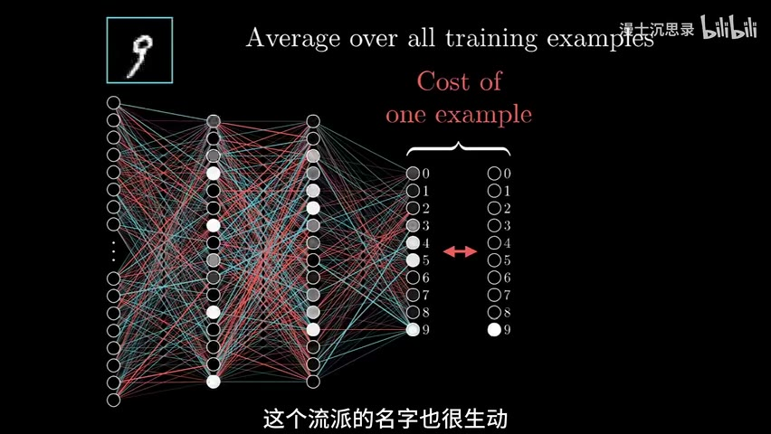

*图 4：作者同版视频 08:58。*

机器学习至少需要三样东西：

1. **模型**：什么形式的黑箱可以被调节。
2. **数据与目标**：哪些例子是正确的。
3. **训练方法**：怎样根据错误调整模型。

这也埋下后面三组概念：

- 神经网络回答“模型长什么样”。
- 损失函数回答“错得有多严重”。
- 梯度下降与反向传播回答“参数怎样改”。

### 检查点

为什么说机器学习不是“把所有答案存起来”？

> 参考答案：它要从训练样本中提取规律，并把规律应用到没见过的新输入。

---

## 第 5 章 联结主义与感知机

**原片时间：10:56-19:56**

联结主义从大脑获得灵感：智能也许来自大量简单单元的连接，而不是一张完整规则表。

### 5.1 用特征识别苹果

假设输入特征是：

$$
x=(\text{大小},\text{红色},\text{甜度},\text{酸度},\ldots)
$$

每个特征乘一个权重：

$$
z=w_1x_1+w_2x_2+\cdots+w_nx_n-b
$$

再做阈值判断：

$$
\hat y=
\begin{cases}
1,&z>0\\
0,&z\le 0
\end{cases}
$$

- 正权重表示这个特征支持“是苹果”。
- 负权重表示它反对“是苹果”。
- $b$ 是阈值。

改变权重和阈值，同一个结构就可以改成西瓜识别器或山楂识别器。权重和阈值是可调的**参数**。

### 5.2 这就是感知机

感知机把多项输入加权求和，再决定是否激活。它既像一个数值化的逻辑单元，也像简化的生物神经元：

- 输入对应传入信号。
- 权重对应连接的促进或抑制强度。
- 激活对应神经元放电。

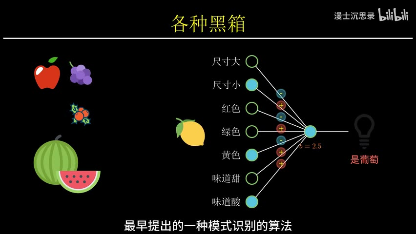

*图 5：作者同版视频 14:52。*

### 5.3 为什么早期感知机会引发轰动

计算机擅长精确算术，却很难理解像素。照片在计算机眼中只是数字矩阵。感知机展示了一种可能：不为每张图片手写规则，而是让机器调整参数，从像素中学会分类。

1957 年，弗兰克·罗森布拉特实现了早期感知机系统。媒体随后对“电子大脑”做出过度乐观的预测。视频借这段历史提醒我们：AI 发展经常在“神化”和“唱衰”之间摆动。

### 检查点

模型和参数有什么区别？

> 参考答案：模型规定可计算的结构和函数族；参数是在这个结构里通过训练确定的具体数值。

---

# 第三部分：从一个神经元到深度学习

## 第 6 章 XOR：单层感知机的天花板

**原片时间：19:56-23:43**

感知机的决策边界满足：

$$
w_1x_1+w_2x_2-b=0
$$

在二维平面中，这是一条直线。因此，一个感知机只能解决**线性可分**的问题。

XOR 的真值表是：

| $x_1$ | $x_2$ | XOR |
|---:|---:|---:|
| 0 | 0 | 0 |
| 0 | 1 | 1 |
| 1 | 0 | 1 |
| 1 | 1 | 0 |

两类点在平面上交叉分布，无法用一条直线分开。

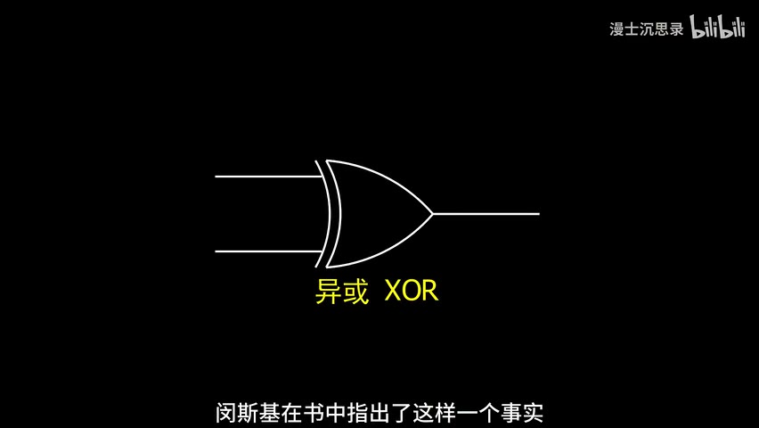

*图 6：作者同版视频 21:44。*

1969 年，马文·闵斯基与西摩·派普特系统讨论了感知机的限制。在资金、算力和训练方法等因素共同作用下，联结主义研究随后经历低谷。

### 不要从失败案例推出错误结论

XOR 证明的是“**单层线性分类器**能力有限”，并不等于“多个非线性单元组成的网络没有用”。下一步恰好是把简单单元组合起来。

### 检查点

感知机解决不了 XOR 的根本原因是什么？

> 参考答案：它只有一条线性决策边界，而 XOR 不是线性可分问题。

---

## 第 7 章 多层感知机：组合带来非线性

**原片时间：23:43-29:37**

一个感知机不够，就让多个感知机先处理中间条件，再把结果交给下一层。

对于 XOR，可以让两个中间神经元分别识别：

- 输入是 $(1,0)$。
- 输入是 $(0,1)$。

输出层再把二者合并。于是，单条直线做不到的分类，可以由多条边界组合完成。

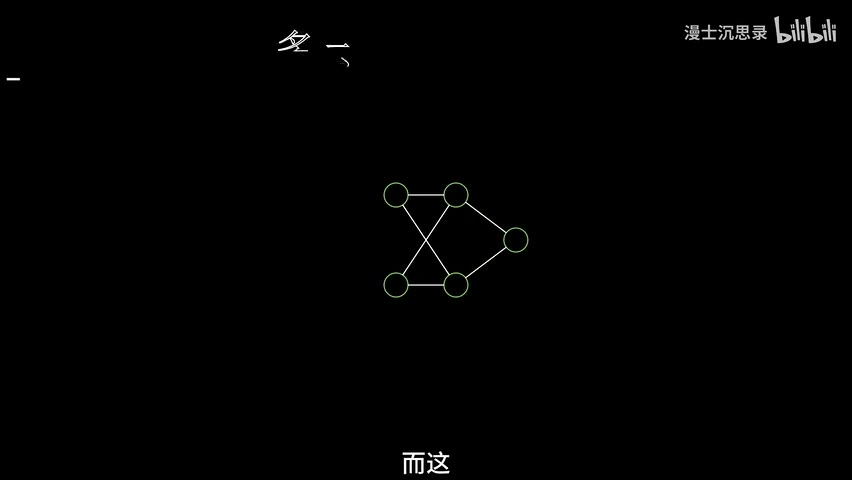

*图 7：作者同版视频 25:56。*

这就是**多层感知机**（MLP）的基本思想：

$$
h=\sigma(W_1x+b_1)
$$

$$
\hat y=\sigma(W_2h+b_2)
$$

其中 $\sigma$ 是非线性激活函数。如果每层都只有线性变换，多层叠加仍然等价于一层线性变换；非线性激活是表达复杂函数的关键。

### 7.1 层级特征

在图像识别中，可以把层级理解为：

```text
像素
→ 边缘和方向
→ 圆弧、横线、折角
→ 数字部件
→ 完整数字
```

深层网络把简单模式逐层组合成复杂概念。重要的是，这些中间特征通常不是专家逐条写入，而是在训练中形成。

### 7.2 从 MLP 到现代架构

视频依次提到：

- **CNN**：利用局部连接和参数共享处理图像。
- **ResNet**：用残差连接缓解深层网络训练困难。
- **DenseNet**：让不同层之间建立更密集的信息连接。
- **Transformer/Attention**：让模型按内容关系选择和组合信息，是 GPT 的基础。

它们都在设计一个更合适的可学习函数族。

> 严谨补充：万能近似定理在特定激活函数和条件下说明网络能近似广泛的连续函数，但“存在一组参数”不等于“训练一定找得到”“数据一定够”或“模型一定能泛化”。

### 检查点

为什么“堆很多线性层”仍然不够？网络需要什么才能表达非线性关系？

> 参考答案：线性变换的复合仍是线性变换；需要非线性激活函数。

---

# 第四部分：神经网络到底怎样学会

## 第 8 章 损失函数：把好坏变成一个数

**原片时间：29:37-35:11**

模型有大量参数。怎样判断一组参数好不好？

先用五次多项式拟合数据：

$$
\hat y=k_0+k_1x+k_2x^2+\cdots+k_5x^5
$$

拟合函数输入 $x$，输出预测 $\hat y$。均方误差损失可以写成：

$$
L(k_0,\ldots,k_5)=\frac{1}{N}\sum_{i=1}^{N}(\hat y_i-y_i)^2
$$

这里出现两个不同函数：

| 函数 | 输入 | 输出 |
|---|---|---|
| 拟合函数 | 样本 $x$ | 预测 $\hat y$ |
| 损失函数 | 模型参数 $k_0,\ldots,k_5$ | 一个表示误差的分数 |

训练的目标就是寻找一组参数，使 $L$ 尽可能小。

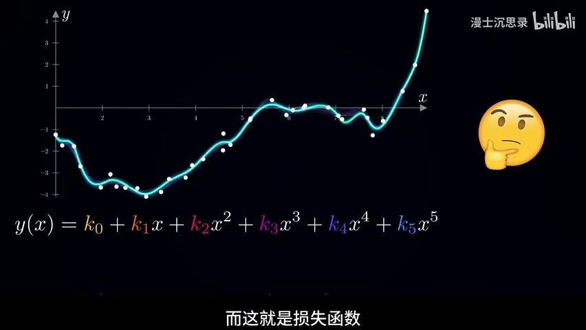

*图 8：作者同版视频 31:24。*

神经网络也一样，只是参数从 6 个变成成千上万乃至数十亿个。权重是旋钮，损失函数是总评分。

### 检查点

损失函数的输入为什么是“参数”，而不是普通样本 $x$？

> 参考答案：在训练数据固定时，不同参数会产生不同预测和总误差；训练要比较的正是不同参数组合。

---

## 第 9 章 梯度下降：在大雾中一步步下山

**原片时间：35:11-41:30**

如果只有一个参数 $k$，导数表示损失随参数变化的局部速度：

$$
\frac{dL}{dk}
$$

- 导数为正：增大 $k$ 会让损失上升，应减小 $k$。
- 导数为负：增大 $k$ 会让损失下降，应增大 $k$。

更新规则：

$$
k\leftarrow k-\eta\frac{dL}{dk}
$$

$\eta$ 是学习率，也就是每次迈多大一步。

多个参数时，把所有偏导数组合成梯度：

$$
\nabla_\theta L=
\left(
\frac{\partial L}{\partial\theta_1},
\frac{\partial L}{\partial\theta_2},
\ldots,
\frac{\partial L}{\partial\theta_n}
\right)
$$

统一更新：

$$
\theta\leftarrow\theta-\eta\nabla_\theta L
$$

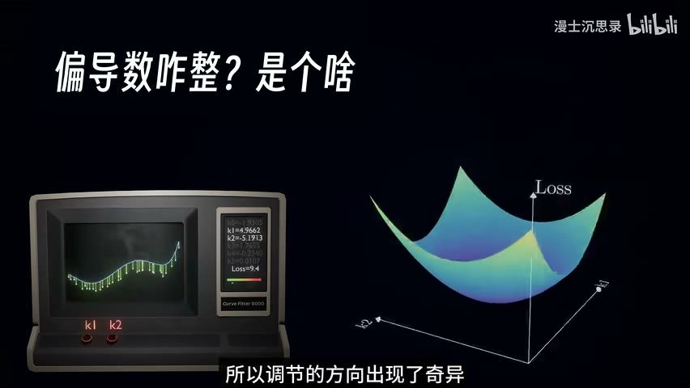

*图 9：作者同版视频 39:34。*

视频的“大雾下山”类比很准确：

- 你看不到完整地形。
- 但能测量脚下哪个方向更陡。
- 每次向下降方向走一小步。
- 反复测量、移动，最终到达一个较低位置。

实际训练还会遇到学习率、鞍点、批次噪声、局部极小值等问题，但核心仍是“用局部梯度指导参数更新”。

> 历史补充：梯度下降思想早于现代神经网络；Linnainmaa 的重要贡献是反向模式自动微分。1986 年 Rumelhart、Hinton、Williams 的工作推动了反向传播在多层网络中的普及。

### 检查点

梯度指向函数上升最快方向，为什么更新公式前面有负号？

> 参考答案：训练要降低损失，所以沿梯度的反方向移动。

---

## 第 10 章 反向传播：从结果倒查每个旋钮

**原片时间：41:30-46:05**

梯度下降需要每个参数的梯度。网络有许多层，怎样高效计算？

关键是链式法则。若：

$$
y=f(g(x))
$$

则：

$$
\frac{dy}{dx}=
\frac{df}{dg}\cdot\frac{dg}{dx}
$$

神经网络由矩阵乘法、加法和激活函数等简单操作组合而成。反向传播从损失开始，沿计算图反向应用链式法则，把“这个中间量变化一点会让最终损失变化多少”逐层传回去。

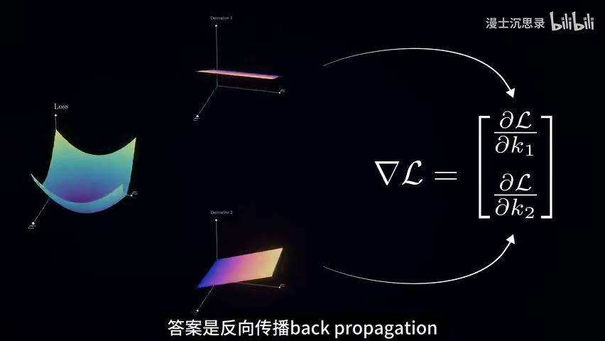

*图 10：作者同版视频 41:42。*

一次训练迭代可以压缩为：

1. **前向传播**：输入数据，得到预测。
2. **计算损失**：比较预测与真实答案。
3. **反向传播**：计算每个参数对损失的影响。
4. **梯度下降**：按负梯度方向更新参数。
5. 重复以上过程。

### 三个概念不要混

| 概念 | 职责 |
|---|---|
| 损失函数 | 定义什么叫好、什么叫坏 |
| 反向传播 | 高效算出每个参数的梯度 |
| 梯度下降 | 根据梯度更新参数 |

### 检查点

“反向传播训练网络”这句话省略了什么？

> 参考答案：反向传播只负责计算梯度，参数通常由梯度下降或其变体更新。

---

# 第五部分：为什么模型能举一反三，又为什么会犯怪错

## 第 11 章 泛化：从训练题走向新题

**原片时间：46:05-50:23**

模型把训练样本记住并不难。真正有用的是：遇到没见过的新输入，仍能给出合理结果。这叫**泛化**。

曲线拟合提供了直觉。即使某个区间没有数据点，我们仍可以根据相邻数据的平滑趋势推测合理数值。神经网络做的是更高维、更抽象的版本：

- 从不同手写体中学到数字结构。
- 从棋谱中学到局面“味道”。
- 从语料中学到语言关系。
- 从氨基酸序列中学习结构规律。

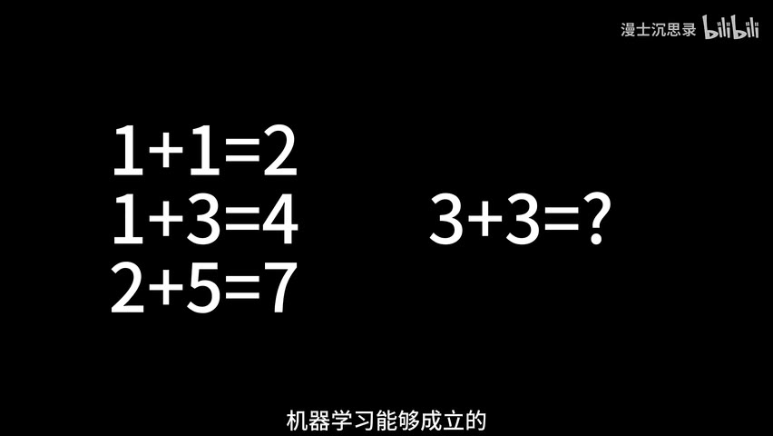

*图 11：作者同版视频 47:06。*

可以把数据分为：

- **训练集**：用于更新参数。
- **验证集**：用于选择模型和超参数。
- **测试集**：用于评估未见数据上的表现。

如果训练误差很低、测试误差很高，模型可能过拟合了。

### 检查点

“训练集准确率 100%”为什么不能证明模型真正学会了？

> 参考答案：它可能只是记住训练样本，需要在未参与训练的数据上验证泛化。

---

## 第 12 章 相关不是因果：神经网络的边界

**原片时间：50:23-53:04**

神经网络从数据中学习统计关联，但关联不自动等于因果。

视频用“柴犬与面包”说明：如果训练数据让“黄色、长条状”等特征频繁和面包标签同时出现，模型可能把柴犬误判为面包。更严重时，偏差数据会让模型把族群特征与犯罪、信用等结论错误绑定。

### 对抗样本

在原图上加入人眼几乎看不出的特殊噪声，模型可能从“熊猫”变成高置信度的“长臂猿”或其他错误类别。噪声不是随机破坏，而是有方向地利用模型的决策边界。

这揭示三点：

1. 高准确率不等于所有输入都可靠。
2. 模型可能依赖人类没有意识到的特征。
3. 黑箱的可解释性和鲁棒性仍是重要研究问题。

### 检查点

为什么“数据更多”不一定自动消除偏差？

> 参考答案：如果新增数据延续同样的选择偏差和错误关联，模型只会更稳定地学会偏差。

---

# 第六部分：GPT 为什么会说话

## 第 13 章 大模型不是先想好整句，而是逐 Token 生成

**原片时间：53:04-55:44**

视频在这里进入第二个专题：GPT 和大语言模型。

人说话时，常常对句子目标和结构有粗略计划。自回归语言模型的基本操作更机械：

1. 读取已有上文。
2. 计算下一个 Token 的概率分布。
3. 选出或采样一个 Token。
4. 把新 Token 接回上文。
5. 重复。

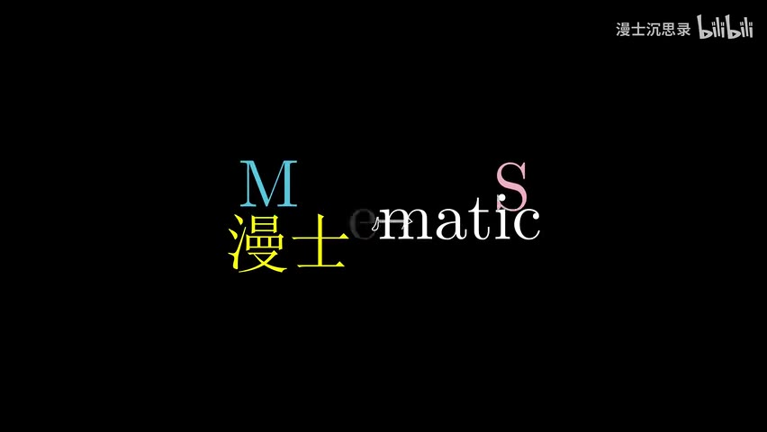

*图 12：作者同版视频 53:38。*

数学上：

$$
P(x_1,\ldots,x_T)=\prod_{t=1}^{T}P(x_t\mid x_1,\ldots,x_{t-1})
$$

一句话的联合概率，被拆成一连串“给定前文，下一 Token 是什么”的条件概率。

Token 不一定等于一个汉字或一个完整单词。它是模型词表中的基本片段。

### 检查点

为什么同一个问题多问几次，模型可能给出不同回答？

> 参考答案：每一步可以从概率分布中采样；不同采样路径会形成不同后文。

---

## 第 14 章 从语法规则到统计语言模型

**原片时间：55:44-62:22**

如果语言只是语法，写出完整语法树就能造出语言智能。但现实不行：

- 符合语法的句子可能毫无意义。
- 新词、隐喻和网络用语不断出现。
- 同一句话在不同语境下含义不同。

早期统计语言模型不再手写全部规则，而是统计词序列：

- Unigram：不看上文。
- Bigram：看前 1 个 Token。
- N-gram：看前 $N-1$ 个 Token。

N-gram 的缺点是上下文短、组合稀疏。RNN、LSTM 再到 Transformer，逐步增强了处理长上下文和复杂关系的能力。

GPT 三个字母对应：

- **G，Generative**：执行生成任务。
- **P，Pre-trained**：先在大规模语料上预训练。
- **T，Transformer**：使用 Transformer 架构。

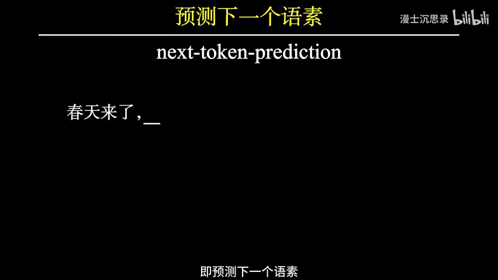

*图 13：作者同版视频 62:04。*

### 为什么简单接龙会产生复杂能力

要准确补全下面这些内容，模型被迫学习不同层次的规律：

- 拼写和搭配。
- 语法结构。
- 指代和上下文。
- 常识和事实模式。
- 文体、任务格式和部分推理模式。

“预测下一个 Token”是训练目标，不是模型最终只能做的应用。就像“预测被遮住的图像部分”可能迫使视觉模型理解物体结构，语言预测也会逼迫模型形成可复用表示。

### 检查点

下一 Token 预测与“背诵训练文本”有什么区别？

> 参考答案：背诵可能是模型行为的一部分，但要在海量不同语境中降低预测误差，模型还必须压缩和复用词法、语法、语义及世界模式。

---

## 第 15 章 为什么叫“大模型”：数据、参数、算力

**原片时间：62:22-67:41**

模型能力扩大依赖三类规模：

1. **数据规模**：书籍、网页、代码、对话等大量语料。
2. **参数规模**：更多可调旋钮提供更强表示能力。
3. **计算规模**：训练和推理需要大量矩阵运算。

预训练仍然沿用前半程讲过的机制：

```text
语料中的前文
→ Transformer 预测下一 Token
→ 计算预测损失
→ 反向传播
→ 梯度下降更新参数
```

因此，大语言模型不是和神经网络课程无关的新魔法。它正是“模型、损失、反向传播、梯度下降、泛化”这条主线的大规模应用。

### 检查点

为什么参数更多不必然代表产品更好？

> 参考答案：能力还受数据质量、架构、训练目标、对齐、推理成本和实际任务约束影响。

---

## 第 16 章 幻觉、理解与对齐

**原片时间：67:41-70:40**

语言模型首先优化的是“生成统计上合理的后文”，不是“每句话都可验证为真”。当证据不足时，它仍可能继续生成语言形式正确但事实错误的内容，这就是常说的**幻觉**。

### 它到底理解了吗

这个问题不必只做哲学争论，可以拆成可测能力：

- 能否在新语境中组合知识？
- 能否保持事实一致？
- 能否解释并修正错误？
- 能否把语言和真实环境中的行动、反馈连接起来？

模型可以具有很强的功能性理解，同时仍缺少可靠事实锚点、持续经验和现实世界交互。

### 从原始模型到助手

仅做预训练的模型只擅长续写。要成为有用助手，还会经过：

- **监督式指令微调**：学习按问题和指令作答。
- **偏好对齐**：学习人类更偏好的回答。
- **基于人类反馈的强化学习等方法**：让输出更有用、更安全。

对齐改善行为，但不能保证消除幻觉，也不能把模型变成事实数据库。

### 检查点

为什么提示“请不要编造”不能从根本上消除幻觉？

> 参考答案：提示只能影响生成分布，不能补上缺失知识，也不能提供外部事实验证机制。

---

# 第七部分：扩散模型为什么能画图

## 第 17 章 从物理扩散到高斯噪声

**原片时间：70:40-74:31**

视频在第三个专题切换到图像和视频生成。

墨水滴进水里、气味散到电梯各处，都是扩散。微观粒子做随机运动，宏观分布逐渐摊开。在大量独立小扰动累积后，分布常趋近高斯分布。


*图 14：作者同版视频 70:54。*

扩散模型定义一个正向加噪过程：

$$
x_t=\sqrt{\bar\alpha_t}x_0+
\sqrt{1-\bar\alpha_t}\epsilon,\qquad
\epsilon\sim\mathcal N(0,I)
$$

- $x_0$ 是原始图片。
- $x_t$ 是第 $t$ 步的带噪图片。
- $t$ 越大，原始结构越弱。
- 最终接近高斯噪声。

正向扩散很容易。生成的关键是：**能否把过程倒过来？**

### 检查点

为什么扩散模型选择高斯噪声作为生成起点？

> 参考答案：高斯分布简单、容易采样，而且正向逐步加噪会把复杂数据分布推向近似高斯分布。

---

## 第 18 章 评分函数：给噪声指出回去的方向

**原片时间：74:31-78:18**

想象一滴墨水逆向聚回原点。我们需要在每个时刻、每个位置知道“往哪里移动会更像原来的数据”。

概率密度 $p_t(x)$ 的评分函数是：

$$
s_t(x)=\nabla_x\log p_t(x)
$$

它指向局部概率密度增长最快的方向。直觉上：

- 低密度位置像离开道路的粒子。
- 评分向量指出更可能的数据区域。
- 不断沿合适方向修正，就能从噪声逐渐回到有结构的样本。

实际模型通常学习预测噪声、速度或与 score 等价的目标。不同参数化的数学形式不同，核心都是估计逆向去噪方向。

### 检查点

评分函数评的不是“图片审美分数”。它真正描述什么？

> 参考答案：当前位置的对数概率密度关于输入的梯度，也就是朝更高数据概率区域移动的局部方向。

---

## 第 19 章 图像流形：真实图片只占像素空间的一小部分

**原片时间：78:18-82:04**

一张图片可以展开成高维向量：

$$
x=(R_1,G_1,B_1,R_2,G_2,B_2,\ldots)
$$

所有可能像素组合构成巨大的“像素空间”。随机选一个点，几乎总是雪花噪声。真实图片满足大量结构约束：

- 相邻像素通常连续。
- 物体有边缘、纹理和形状。
- 光影和透视存在规律。
- 语义部件以特定方式组合。

因此，真实图片集中在高维空间中很小、但结构复杂的数据区域，常被直观称为**数据流形**。

扩散生成的任务，就是从随机噪声点出发，逐步走向这个高概率数据区域。

### 检查点

为什么随机生成一组 RGB 数值，几乎不可能正好得到一张有意义的照片？

> 参考答案：满足自然图像全部结构约束的像素组合，只占整个像素空间极小区域。

---

## 第 20 章 用神经网络学习去噪

**原片时间：82:04-85:35**

真实数据只给了我们离散样本，不会直接给出每个位置的评分方向。解决办法又回到了神经网络：

1. 收集真实图片 $x_0$。
2. 随机选择时间步 $t$。
3. 加入已知噪声 $\epsilon$，得到 $x_t$。
4. 让神经网络根据 $x_t$、$t$ 和文本条件预测噪声或去噪方向。
5. 用预测误差构造损失。
6. 反向传播并更新网络。

训练完成后：

1. 从随机高斯噪声开始。
2. 网络预测当前一步应去掉什么噪声。
3. 更新得到稍清晰的样本。
4. 重复许多步，形成图像。

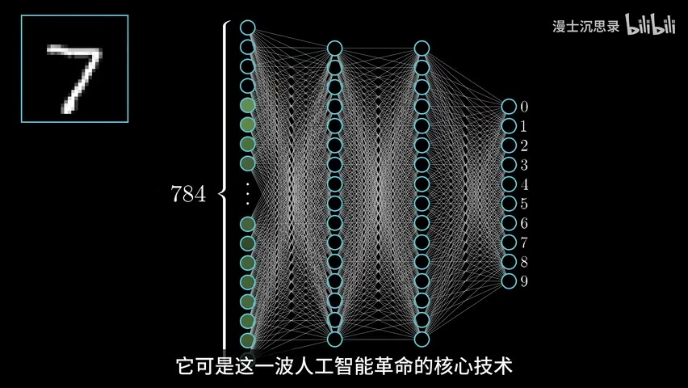

*图 15：作者同版视频 82:27。*

文本生成图像还要把提示词编码成条件，让去噪过程不只走向“任意真实图片”，而是走向“符合文字描述的真实图片”。

视频生成在像素结构之外，还要保持时间连续性。每一帧都清晰仍然不够，人物身份、物体运动和镜头变化必须前后一致。

### 从本章回看全课

扩散模型仍然遵循同一套机器学习框架：

```text
输入：带噪图片、时间步、文本条件
模型：神经网络
目标：预测噪声或去噪方向
评分：去噪损失
训练：反向传播 + 梯度下降
泛化：生成训练集中没有的合理图像
```

### 检查点

扩散模型中的神经网络为什么不是简单“保存所有训练图片”？

> 参考答案：它学习在不同噪声强度、不同位置和不同条件下的去噪规律，再把规律应用到新的随机起点。

---

# 第八部分：AI 会怎样改变工作

## 第 21 章 被替代的首先是任务，不一定是整个职业

**原片时间：85:35-88:58**

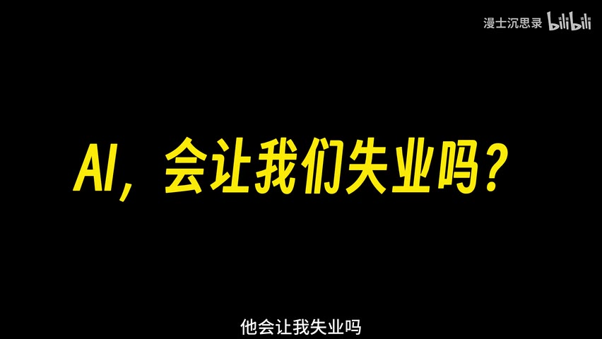

*图 16：作者同版视频 85:38。*

一项任务越符合以下条件，越容易被当前 AI 自动化：

- 数据充足。
- 输入输出明确。
- 模式稳定。
- 评价标准可计算或可反馈。
- 错误成本可控制。

因此，文秘、翻译、基础内容制作、财务处理和部分编程工作中的重复环节会受到冲击。但一个职业通常包含多种任务：

- 信息整理可以自动化，责任判断仍需人。
- 初稿可以生成，目标、审美和取舍仍需人。
- 代码可以补全，需求澄清、系统设计和事故负责仍需人。
- 论文可以润色，研究问题和证据责任仍需研究者承担。

### AI 当前的重要边界

- 对超出训练分布的新情况不稳定。
- 可能把相关性误当因果性。
- 会生成看似合理的错误内容。
- 缺乏持续、完整的现实世界经验。
- 机器人和自动驾驶还受物理环境、安全和长尾情况限制。

### 对个人更可执行的策略

1. 把自己的工作拆成任务，而不是只看职位名称。
2. 找出可自动化的重复步骤，主动用 AI 提效。
3. 把时间迁移到目标定义、判断、沟通、创意和责任承担。
4. 学会验证 AI 输出，不把流畅当正确。
5. 理解数据、损失和边界，避免把 AI 当魔法。

---

# 全课总复盘

## 一条公式链

**智能函数：**

$$
\hat y=f_\theta(x)
$$

**损失函数：**

$$
L(\theta)=\text{difference}\bigl(f_\theta(x),y\bigr)
$$

**反向传播：**

$$
\nabla_\theta L
$$

**梯度下降：**

$$
\theta\leftarrow\theta-\eta\nabla_\theta L
$$

**泛化：**

$$
x_{\text{new}}\rightarrow f_\theta(x_{\text{new}})
\rightarrow \text{合理的新输出}
$$

GPT 和扩散模型只是选择了不同的 $x$、$y$、模型结构与训练目标：

| 系统 | 输入 | 学习目标 | 输出 |
|---|---|---|---|
| 图像分类 | 图片 | 正确类别 | 类别概率 |
| GPT | 上文 Token | 下一 Token | 文本 |
| 扩散模型 | 带噪样本、时间、条件 | 噪声/去噪方向 | 图片或视频 |

## 术语表

| 术语 | 一句话解释 |
|---|---|
| 人工智能 | 让人工系统完成需要智能的输入输出任务 |
| 符号主义 | 用符号、知识和逻辑规则实现智能 |
| 机器学习 | 让模型根据数据和目标自动调整 |
| 联结主义 | 用大量简单单元及其连接构造智能 |
| 模型 | 规定可学习函数结构 |
| 参数 | 训练中被调整的数值 |
| 感知机 | 加权求和后进行阈值判断的线性分类器 |
| MLP | 多层感知机组成的前馈神经网络 |
| 激活函数 | 为网络引入非线性 |
| 损失函数 | 衡量模型预测有多差 |
| 梯度 | 损失对各参数的局部变化率 |
| 梯度下降 | 沿负梯度方向更新参数 |
| 反向传播 | 用链式法则高效计算网络梯度 |
| 泛化 | 在未见数据上仍能合理预测 |
| Token | 语言模型处理文本的基本片段 |
| Transformer | 使用注意力机制处理序列关系的网络架构 |
| 自回归 | 把已生成内容作为输入继续生成 |
| 幻觉 | 模型生成流畅但事实不可靠的内容 |
| 扩散模型 | 学习逆转逐步加噪过程的生成模型 |
| Score | 对数概率密度关于输入的梯度 |
| 数据流形 | 高维空间中真实数据集中分布的结构区域 |

## 结业自测

1. 为什么可以把智能抽象成函数，又为什么“任何函数”不等于“有用智能”？
2. 符号主义和机器学习的知识分别主要来自哪里？
3. 单层感知机为什么不能解决 XOR？多层网络如何突破？
4. 损失函数、反向传播、梯度下降三者分别做什么？
5. 什么是泛化？怎样区分泛化和记忆？
6. 下一 Token 预测为什么可能学出语法和语义能力？
7. 大模型为什么会幻觉？对齐为什么不能保证消除幻觉？
8. 扩散模型为什么先把图像加成噪声，再学习逆过程？
9. 图像流形的直觉是什么？
10. 用本课框架分析自己的一个工作任务：输入、输出、数据、损失、风险分别是什么？

## 结业标准

不看文档，能够从“智能是输入到输出的函数”开始，用 10 分钟连续讲清：

```text
符号主义
→ 机器学习
→ 感知机
→ XOR
→ 多层神经网络
→ 损失函数
→ 梯度下降与反向传播
→ 泛化与局限
→ GPT
→ 扩散模型
→ AI 与工作
```

若其中任一箭头只能背名词、说不出“前一个问题为什么引出后一个概念”，就回到相应章节重学。

---

## 来源与版权

作品身份、时间线、文字核对和截图的完整说明见 [SOURCE_NOTES.md](SOURCE_NOTES.md)。原视频、动画和引用素材版权归原作者及相应权利人所有。本课程为学习研究用途的结构化笔记，不替代原视频。
