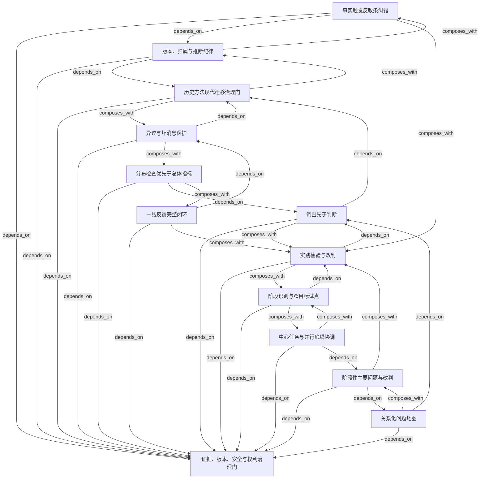

# mao-methods — Capability Index

> Profile: `methodology` · Pack schema: `0.3`

## 阅读入口

- [Object Overview](OBJECT_OVERVIEW.md)
- [Candidate Portfolio](CANDIDATE_PORTFOLIO.md)
- [Verified Portfolio](VERIFIED_PORTFOLIO.md)
- [Glossary](GLOSSARY.md)
- [Digest](DIGEST.md)
- [Learning Path](LEARNING_PATH.json)
- [Runtime Skill](skills/mao-methods/SKILL.md)

## 能力模块

### principle

- [事实触发反教条纠错](skills/mao-methods/references/modules/anti-dogmatism-correction.md)：理论、上级转述或既有文本与可核验事实冲突（状态：`supporting`）
- [分布检查优先于总体指标](skills/mao-methods/references/modules/distribution-before-aggregate.md)：总体数据、高频声音或资源聚焦掩盖无发言权群体承担的局部损害（状态：`verified`）
- [异议与坏消息保护](skills/mao-methods/references/modules/protected-dissent-channel.md)：坏消息会使报告者受罚，决策系统只能收到支持性信息（状态：`verified`）
- [历史方法现代迁移治理门](skills/mao-methods/references/modules/rights-bound-transfer.md)：历史战争、政治和运动语言被直接套到现代组织与个人（状态：`supporting`）
- [版本、归属与推断纪律](skills/mao-methods/references/modules/version-attribution.md)：公开定稿、现场记录、编辑文本和现代推断被混成作者原话（状态：`supporting`）

### framework

- [中心任务与并行底线协调](skills/mao-methods/references/modules/center-work-coordination.md)：组织需要聚焦，但多个底线和必要协同不能停止（状态：`supporting`）
- [阶段性主要问题与改判](skills/mao-methods/references/modules/contradiction-reclassification.md)：多个问题争夺注意力，当前优先项不清楚（状态：`supporting`）
- [一线反馈完整闭环](skills/mao-methods/references/modules/feedback-integrity.md)：组织收集了意见，但没有形成可修正的方案与结果返回（状态：`verified`）
- [调查先于判断](skills/mao-methods/references/modules/investigation-before-judgment.md)：重要结论主要来自转述、单一样本或管理层想象（状态：`supporting`）
- [实践检验与改判](skills/mao-methods/references/modules/practice-test-loop.md)：方法结论停留在解释层，无法被现实结果推翻（状态：`supporting`）
- [关系化问题地图](skills/mao-methods/references/modules/relational-problem-map.md)：复杂问题被简化为某个人或群体有问题（状态：`supporting`）
- [阶段识别与窄目标试点](skills/mao-methods/references/modules/stage-experimentation.md)：资源弱或不确定性高，却试图一次全面推进（状态：`supporting`）

## 能力关系图

## 推荐学习顺序

1. **历史方法现代迁移治理门**（先修：无）
2. **调查先于判断**（先修：rights-bound-transfer）
3. **异议与坏消息保护**（先修：rights-bound-transfer）
4. **版本、归属与推断纪律**（先修：rights-bound-transfer）
5. **事实触发反教条纠错**（先修：version-attribution）
6. **分布检查优先于总体指标**（先修：investigation-before-judgment）
7. **一线反馈完整闭环**（先修：protected-dissent-channel）
8. **实践检验与改判**（先修：investigation-before-judgment）
9. **关系化问题地图**（先修：investigation-before-judgment）
10. **阶段性主要问题与改判**（先修：relational-problem-map）
11. **阶段识别与窄目标试点**（先修：practice-test-loop）
12. **中心任务与并行底线协调**（先修：contradiction-reclassification）

## 状态纪律

- `candidate` 只表示已生成且可审计，不表示真实任务有效。
- 只有完整 Answer Agent/Judge 结果和发布硬门通过后才能安装。
