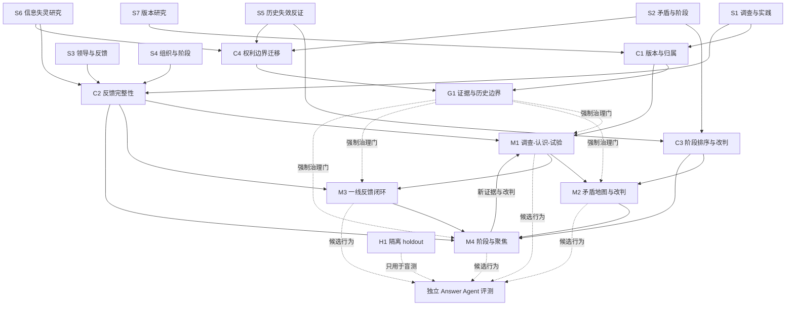

# 毛泽东著作方法候选知识图谱

> 状态：`candidate / verify: blocked`
>
> 本页是供人阅读的候选导航，不表示能力已经通过 V2 行为验证。机器状态以
> [PIPELINE_STATE.json](PIPELINE_STATE.json) 为准；独立 Answer Agent、holdout
> 和 paired comparison 完成前，不得把本 Pack 标记为 released。

## 阅读入口

- [候选 Skill](../../examples/mao-methods/skill/mao-methods/SKILL.md)：一个显式激活入口，按需路由到四个方法模块。
- [候选产物说明](CANDIDATE_OUTPUT.md)：已经完成和尚未完成的证明。
- [来源质量报告](SOURCE_QUALITY.json)：来源集合、独立来源组、反证和 holdout。
- [证据账本](EVIDENCE_LEDGER.jsonl)：逐条证据及其 Chunk、文档版本和来源定位。
- [候选判定](verified/decisions.json)：结构化 Claim 的当前验证状态。
- [机器学习路径](LEARNING_PATH.json)：摄取阶段生成的 source-order 节点。
- [社区对比](../../examples/mao-methods/COMMUNITY_COMPARISON.md)：与 GitHub 同类 Skills 的冻结版本对比。

## 使用范围

本 Pack 蒸馏的是公开历史文本中的可迁移方法，不是人物模拟，也不是完整的毛泽东思想或历史知识库。

候选能力只覆盖：

1. 调查、认识与可逆试验；
2. 多重矛盾的阶段性排序与改判；
3. 一线反馈、方案返回与坏消息通道；
4. 弱势条件下的阶段识别与资源聚焦；
5. 贯穿上述方法的版本、反证、权利和历史失效边界。

明确不覆盖：

- 第一人称人格模拟或“毛泽东会怎么说”；
- 阶级敌人、敌友清洗、政治动员或战争行动的现代执行；
- 毛泽东生平、年代和原文查找等普通历史问答；
- 未经独立验证的历史因果或现实效果断言。

## 图谱图例

| 标记 | 含义 |
|---|---|
| `S` | 构建来源，已通过 Source Catalog 集合质量门 |
| `H` | 隔离 holdout，不参与正文构建 |
| `C` | 结构化 Claim，已满足跨语境和独立来源组要求，但仍待 V2 |
| `M` | 可运行的候选方法模块 |
| `G` | 所有模块都必须经过的治理门 |
| `needs_model_verification` | 证据结构通过，预测力和行为结果尚未独立验证 |

## 来源层

| ID | 来源 | 角色 | 主要用途 |
|---|---|---|---|
| S1 | [调查研究与实践认识循环](../../examples/mao-methods/sources/01-investigation-practice.md) | 一手证据 | 调查、实践、认识循环 |
| S2 | [矛盾特殊性与阶段性优先级](../../examples/mao-methods/sources/02-contradiction-prioritization.md) | 一手证据 | 多重矛盾、阶段排序、条件转化 |
| S3 | [从一线经验到方案再到检验](../../examples/mao-methods/sources/03-leadership-feedback.md) | 一手证据 | 反馈整理、方案返回、再次验证 |
| S4 | [组织认知、试点与阶段推进](../../examples/mao-methods/sources/04-organization-and-stages.md) | 一手证据 | 组织反馈、中心任务、阶段聚焦 |
| S5 | [1981 年历史决议中的失效边界](../../examples/mao-methods/sources/05-official-historical-boundaries.md) | 官方反证 | 敌我混淆、权力集中、制度失灵 |
| S6 | [大饥荒中的制度性信息失灵](../../examples/mao-methods/sources/06-scholarly-information-failure.md) | 独立验证锚点 | 坏消息上行、总体指标与局部损害 |
| S7 | [《实践论》的版本与归属](../../examples/mao-methods/sources/07-version-and-attribution.md) | 版本背景 | 公开定稿、现场记录和现代推断的区分 |
| H1 | [公共卫生与死亡率研究](../../examples/mao-methods/sources/99-holdout-public-health.md) | `evaluation_only` | 测试能否同时呈现改善、逆转与数据限制 |

来源集合当前指标：

```text
候选来源：8
进入构建：7
隔离 holdout：1
独立来源组：4
一手来源：4
研究问题覆盖率：100%
平均质量分：0.965
```

## 结构化 Claim 层

| ID | Claim | 独立来源 | 当前状态 | 约束的能力 |
|---|---|---:|---|---|
| C1 | `version-attribution`：区分最终公开版本、现场记录和现代推断，不能伪造人物立场 | 是 | `needs_model_verification` | M1-M4 |
| C2 | `feedback-integrity`：一线证据、暂时判断、可逆试验和独立坏消息通道必须形成闭环 | 是 | `needs_model_verification` | M1、M3、M4 |
| C3 | `contradiction-reclassification`：矛盾排序必须是可改判的阶段假设，不能把普通分歧转为敌我身份 | 是 | `needs_model_verification` | M2、M4 |
| C4 | `rights-bound-transfer`：现代迁移必须非暴力、守法、可逆，并保留申辩和复核 | 是 | `needs_model_verification` | G1、M1-M4 |

“独立来源：是”只表示 provenance group 满足确定性门，不等于 Claim 已证明具有预测力。

## 候选能力层

| ID | 模块 | 输入信号 | 核心产物 | 先修 |
|---|---|---|---|---|
| G1 | [历史边界与证据纪律](../../examples/mao-methods/skill/mao-methods/references/05-boundaries-and-evidence.md) | 所有请求 | 来源分层、反证、停止条件、权利检查 | 无 |
| M1 | [调查—认识—试验](../../examples/mao-methods/skill/mao-methods/references/01-investigate-and-test.md) | 结论依赖转述、单一样本或模型推测 | 核心问题、样本计划、假设修订表、可逆试验 | G1 |
| M2 | [矛盾地图与改判](../../examples/mao-methods/skill/mao-methods/references/02-map-contradictions.md) | 多个问题争夺注意力，优先级不清 | 候选关系、支持与反证、外溢影响、改判条件 | G1、M1 |
| M3 | [一线反馈闭环](../../examples/mao-methods/skill/mao-methods/references/03-feedback-loop.md) | 一线经验分散，方案缺少参与和返回验证 | 样本边界、异议渠道、试点、退出与复核 | G1、M1 |
| M4 | [阶段与聚焦](../../examples/mao-methods/skill/mao-methods/references/04-stage-and-focus.md) | 资源弱、目标多或需要分阶段推进 | 阶段判断、窄目标、底线、切换和回滚条件 | G1、M2、M3 |

推荐执行主干：

```text
事实不足
  -> M1 调查并形成可证伪材料
  -> M2 选择阶段性主要问题
  -> M3 把方案返回一线做可逆验证
  -> M4 根据结果保持、扩展、收缩或改判
  -> 回到 M1，进入下一轮认识循环

G1 在每一步检查来源、反证、权利和停止条件。
```

## 候选知识图谱



## 学习路线

这条路线是供人学习和演练的 capability-prerequisite 路线；它不会替换
[LEARNING_PATH.json](LEARNING_PATH.json) 中用于机器追踪的 source-order 路线。

### 阶段 0：证据和边界

**目标**

- 区分一手文本、官方历史决议、独立研究和现代迁移；
- 理解“文本中出现”不等于“方法有效”；
- 能说出五个停止条件。

**阅读**

1. G1 [历史边界与证据纪律](../../examples/mao-methods/skill/mao-methods/references/05-boundaries-and-evidence.md)
2. S7 [版本与归属](../../examples/mao-methods/sources/07-version-and-attribution.md)
3. S5 [历史失效边界](../../examples/mao-methods/sources/05-official-historical-boundaries.md)

**掌握检查**

- 把一句历史文本分别写成“原文陈述”“机制解释”“现代建议”；
- 指出每一层能证明什么、不能证明什么；
- 遇到敌我标签、坏消息受罚或无申诉机制时，能够停止执行。

### 阶段 1：调查—认识—试验

**目标**

- 从抽象争论转向可定位的一手材料；
- 识别样本、提问方式和权力在场造成的偏差；
- 把结论改写成可被短周期结果推翻的假设。

**阅读**

1. M1 [调查—认识—试验](../../examples/mao-methods/skill/mao-methods/references/01-investigate-and-test.md)
2. S1 [调查研究与实践认识循环](../../examples/mao-methods/sources/01-investigation-practice.md)

**练习产物**

```text
唯一核心问题：
调查前假设：
三类不同处境的对象：
反证或未知项：
可逆试验：
成功 / 失败 / 停止条件：
```

**掌握检查**

- 至少两类独立角色提供可定位材料；
- 至少记录一个反证或未知项；
- 试验失败不会造成不可逆权利或安全损害。

### 阶段 2：矛盾地图与改判

**先修**：阶段 0、阶段 1。

**目标**

- 把人身归因改写为目标、资源、事实、流程或权利关系；
- 提出至少两个主要问题候选；
- 给当前优先级设置改判信号。

**阅读**

1. M2 [矛盾地图与改判](../../examples/mao-methods/skill/mao-methods/references/02-map-contradictions.md)
2. S2 [矛盾特殊性与阶段性优先级](../../examples/mao-methods/sources/02-contradiction-prioritization.md)

**练习产物**

| 候选关系 | 支持证据 | 备选解释 | 外溢影响 | 改判条件 |
|---|---|---|---|---|
| A |  |  |  |  |
| B |  |  |  |  |

**掌握检查**

- 不把“主要矛盾”写成永久真理；
- 不以聚焦为理由忽略安全、法律和基本权利；
- 能解释什么新事实会改变排序。

### 阶段 3：一线反馈闭环

**先修**：阶段 0、阶段 1。

**目标**

- 区分事实、诉求、解释、建议、反对和未知；
- 建立安全的异议与坏消息渠道；
- 把试点结果和未采纳理由返回参与者。

**阅读**

1. M3 [一线反馈闭环](../../examples/mao-methods/skill/mao-methods/references/03-feedback-loop.md)
2. S3 [从一线经验到方案再到检验](../../examples/mao-methods/sources/03-leadership-feedback.md)
3. S6 [制度性信息失灵](../../examples/mao-methods/sources/06-scholarly-information-failure.md)

**掌握检查**

- 样本范围被公开，高频声音没有被冒充为总体；
- 批评者不会因报告坏消息受罚；
- 收集、解释、执行和复核没有全部集中于同一主体；
- 试点结果能够真实改变原方案。

### 阶段 4：阶段与聚焦

**先修**：阶段 2、阶段 3。

**目标**

- 区分探索、验证、扩展和收缩；
- 选择能积累能力、证据或选择权的窄目标；
- 定义阶段切换、停止和回滚条件。

**阅读**

1. M4 [阶段与聚焦](../../examples/mao-methods/skill/mao-methods/references/04-stage-and-focus.md)
2. S4 [组织认知、试点与阶段推进](../../examples/mao-methods/sources/04-organization-and-stages.md)

**掌握检查**

- 聚焦没有牺牲安全、合规、现金流和人员健康底线；
- 局部成功具有复用条件，不是一次性偶然；
- 延长周期确实在积累能力，而不是为失败找理由。

### 阶段 5：综合演练与发布门

**先修**：阶段 0-4。

**综合任务**

选择一个低风险真实问题，依次完成：

1. 事实契约与来源分层；
2. 调查计划和至少一个反证；
3. 两个以上主要问题候选及改判条件；
4. 一线反馈、异议、退出和复核机制；
5. 可逆试点及阶段切换条件；
6. G1 的五项停止条件检查。

**候选行为测试**

- [canonical 用例](../../examples/mao-methods/skill/mao-methods/evals/canonical.json)
- [运行时测试提示](../../examples/mao-methods/skill/mao-methods/test-prompts.json)
- H1 holdout：仅在候选 Skill 冻结后，由独立 Answer Agent 运行。

**发布条件**

- canonical 和 holdout 都保存完整 Answer Agent 输出；
- should-trigger、should-not-trigger、sibling、failure、safety 和 task-effect 门全部通过；
- 与至少一个社区基线做同题 paired comparison；
- 评测事件不回流为训练证据；
- 人工批准后才能从 `candidate` 晋升为 `released`。

## 快速路由

| 用户当前需要 | 起点 | 下一步 |
|---|---|---|
| 只有传闻或管理层判断，没有一手材料 | M1 | 取得证据后进入 M2 或 M3 |
| 已有材料，但不知道先解决什么 | M2 | 用 M4 设计阶段行动 |
| 已有方案，但一线没有参与或无法报告坏消息 | M3 | 反馈可改变方案后再进入 M4 |
| 目标过多、资源弱或不知道何时扩展 | M4 | 用结果回到 M1 重新认识 |
| 出现敌我标签、强迫服从、不可逆伤害或无复核 | G1 | 停止扩展，只输出补证和治理修复 |

## 当前验证缺口

- 4 个结构化 Claim 均为 `needs_model_verification`；
- 候选 Skill 的首个显式触发用例仍需修复检索别名；
- canonical 尚无独立 Answer Agent 完整输出；
- H1 尚未执行盲测；
- 尚未与 Cangjie/GitHub 对照 Skills 做同题 paired comparison；
- 因此本页只提供候选知识组织和学习导航，不改变 `verify: blocked`。
