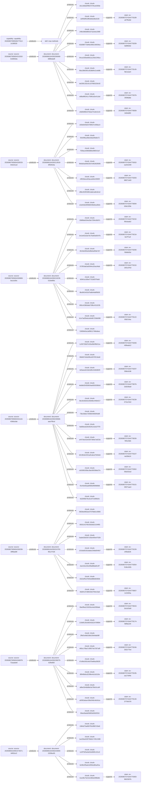

# Evidence Graph

```mermaid
flowchart LR
  ne78cdd46059c["capability: capability-20260807090949277612-2c395f29"]
  n2651b40c3168["skill: mao-methods"]
  ne78cdd46059c -->|produces| n2651b40c3168
  n0a31a1903e82["chunk: chunk-0be0fba215026ce4a2099afe"]
  nfd29d28fc46e["claim: ev-20260807074344778043-2b1625d0"]
  n0a31a1903e82 -->|supports| nfd29d28fc46e
  n7b87623d9433["chunk: chunk-1016a50181dabe234bd044b7"]
  n130315954d04["claim: ev-20260807074344778159-ef36a626"]
  n7b87623d9433 -->|supports| n130315954d04
  n2b1161c01010["chunk: chunk-1c59725b97e30a3b83fb011a"]
  nb1bf34823b7f["claim: ev-20260807074344778269-469ea6c2"]
  n2b1161c01010 -->|supports| nb1bf34823b7f
  n19c2c3ac7d4c["chunk: chunk-1df456f533ffcbbfa38ed100"]
  n20e8f1a8e588["claim: ev-20260807074344778189-a07f6c8d"]
  n19c2c3ac7d4c -->|supports| n20e8f1a8e588
  nab7c79b9a6cc["chunk: chunk-219d9135c68342622476f894"]
  n5848b5a2ccea["claim: ev-20260807074344778174-9bf8a104"]
  nab7c79b9a6cc -->|supports| n5848b5a2ccea
  n3b5d122f9701["chunk: chunk-296fb6e034e26e7294c60d7c"]
  n0457820ba1b3["claim: ev-20260807074344778232-95cbaab2"]
  n3b5d122f9701 -->|supports| n0457820ba1b3
  n7452b1ac43e5["chunk: chunk-2e1ee52a3a7dc7ba93a5047b"]
  n2562829e714e["claim: ev-20260807074344778216-0a7f7cef"]
  n7452b1ac43e5 -->|supports| n2562829e714e
  nf7d511b31c75["chunk: chunk-2ee316c20e49fa888a6fc3f7"]
  n446f38598056["claim: ev-20260807074344778354-518e182b"]
  nf7d511b31c75 -->|supports| n446f38598056
  nd86de30abece["chunk: chunk-351fdc855e5ef8d4a959e7b7"]
  ndad1231649f1["claim: ev-20260807074344778290-f366b05d"]
  nd86de30abece -->|supports| ndad1231649f1
  nc456ccbc0681["chunk: chunk-372f53ab3a5594cd1facd4ab"]
  n4e5c8df59f67["claim: ev-20260807074344778152-1651d763"]
  nc456ccbc0681 -->|supports| n4e5c8df59f67
  nd9d938402243["chunk: chunk-43d388773d4be366218639a1"]
  n1a68c869c630["claim: ev-20260807074344778209-9d9f6592"]
  nd9d938402243 -->|supports| n1a68c869c630
  n8e1f0e9e9d71["chunk: chunk-460cc76ba7c99574a7357af9"]
  na9c880667d54["claim: ev-20260807074344778246-355277b4"]
  n8e1f0e9e9d71 -->|supports| na9c880667d54
  n33a403bd28c9["chunk: chunk-4e5aeeefc3dc6d9c34d0d829"]
  na9d7511b89ce["claim: ev-20260807074344778297-358e3c96"]
  n33a403bd28c9 -->|supports| na9d7511b89ce
  n1eb323dcfcb2["chunk: chunk-4eb8e55450604ae6930380e5"]
  n04e47fce85a8["claim: ev-20260807074344778076-2b3036a9"]
  n1eb323dcfcb2 -->|supports| n04e47fce85a8
  n2b8af1fb2878["chunk: chunk-5bc3e3d2d1150e6bc446e517"]
  nb92e1206d9e1["claim: ev-20260807074344778239-072a7e52"]
  n2b8af1fb2878 -->|supports| nb92e1206d9e1
  nc815c68d6c99["chunk: chunk-8f948fafcd2298e4cb1b310e"]
  n270c970dc42d["claim: ev-20260807074344778195-aa17d49c"]
  nc815c68d6c99 -->|supports| n270c970dc42d
  nefae50fbc6a3["chunk: chunk-9ba18b6391c82db84c2ceb8b"]
  nfa6fb4849d0a["claim: ev-20260807074344778145-fde1eae4"]
  nefae50fbc6a3 -->|supports| nfa6fb4849d0a
  n83d9944d0517["chunk: chunk-9bda0aa59d23b7e462828585"]
  n6b68a5b6d250["claim: ev-20260807074344778262-ea442209"]
  n83d9944d0517 -->|supports| n6b68a5b6d250
  ncb4678ebba73["chunk: chunk-a447ebc52e53073b9a7a623a"]
  nbfd92c455914["claim: ev-20260807074344778030-78f124b5"]
  ncb4678ebba73 -->|supports| nbfd92c455914
  n689163b0e56f["chunk: chunk-a9392abac436e548c4dcfa1a"]
  ndf62178ca1fe["claim: ev-20260807074344778130-37784376"]
  n689163b0e56f -->|supports| ndf62178ca1fe
  na514574e6532["chunk: chunk-b1e39c7b210c485e63f86dfc"]
  n3e690047d774["claim: ev-20260807074344778383-9602587b"]
  na514574e6532 -->|supports| n3e690047d774
  neb1557c8c184["chunk: chunk-b1e7ad35edca5e8b720db088"]
  n3af57a722a74["claim: ev-20260807074344778122-9f367d4a"]
  neb1557c8c184 -->|supports| n3af57a722a74
  n2b2ca72e8e0e["chunk: chunk-b519b3e4331a81abcd7b94e6"]
  ne80943d48eaa["claim: ev-20260807074344778167-4e30fe24"]
  n2b2ca72e8e0e -->|supports| ne80943d48eaa
  nee9c64cb8dc0["chunk: chunk-bfa94137afbfc0eb794e15a6"]
  n2968a915f3e9["claim: ev-20260807074344778067-2c334f4a"]
  nee9c64cb8dc0 -->|supports| n2968a915f3e9
  n2c9cf8558b49["chunk: chunk-cb5395335bc3be30039de27e"]
  nfcfb0385de78["claim: ev-20260807074344778362-55b202a3"]
  n2c9cf8558b49 -->|supports| nfcfb0385de78
  n3100a1643f27["chunk: chunk-cf653bece63aca4efe43905f"]
  nf4f6a416bfef["claim: ev-20260807074344778283-896714d3"]
  n3100a1643f27 -->|supports| nf4f6a416bfef
  n661fec10b54a["chunk: chunk-e2a53dcbf0668448e6ea38cb"]
  n277cfce8b6b6["claim: ev-20260807074344778094-b5dc328e"]
  n661fec10b54a -->|supports| n277cfce8b6b6
  n79ac9b72e357["chunk: chunk-e88a9f6341c75991d2e41cbd"]
  nb8291d9fd788["claim: ev-20260807074344778376-3f396dbb"]
  n79ac9b72e357 -->|supports| nb8291d9fd788
  ne7ba5acb9f7b["chunk: chunk-e9d569fb447b5a474c8c5143"]
  n1b97e5c10732["claim: ev-20260807074344778009-3494d9f2"]
  ne7ba5acb9f7b -->|supports| n1b97e5c10732
  nf2a293748fee["chunk: chunk-f3c45e60aabf080ef8998968"]
  nbf1bc08c47c2["claim: ev-20260807074344778101-39371ae4"]
  nf2a293748fee -->|supports| nbf1bc08c47c2
  ne2aa08f0f25d["document: document-20260806164350206068-688bdad9"]
  n8cfaf68531a0["chunk: chunk-16c1d9a92f9637376ce0359e"]
  ne2aa08f0f25d -->|produces| n8cfaf68531a0
  ne2aa08f0f25d -->|produces| n19c2c3ac7d4c
  n9b08f3103f85["chunk: chunk-248c0d6dd60cb7a2a4a13fd9"]
  ne2aa08f0f25d -->|produces| n9b08f3103f85
  ne2aa08f0f25d -->|produces| nd9d938402243
  n1cef6d512397["chunk: chunk-54ca192bed0d1a125dc248ca"]
  ne2aa08f0f25d -->|produces| n1cef6d512397
  ne2aa08f0f25d -->|produces| nefae50fbc6a3
  n05b8a773a733["chunk: chunk-de2081332c5c107683226c92"]
  ne2aa08f0f25d -->|produces| n05b8a773a733
  ne2aa08f0f25d -->|produces| n79ac9b72e357
  ne2aa08f0f25d -->|produces| ne7ba5acb9f7b
  nc1447dbc254f["document: document-20260806164350213918-6f5052ba"]
  n00ac549e6a5a["chunk: chunk-165d0ef3d25789537c008a14"]
  nc1447dbc254f -->|produces| n00ac549e6a5a
  n4a722d41ee7d["chunk: chunk-5542ffeac8be4afa26fa6e72"]
  nc1447dbc254f -->|produces| n4a722d41ee7d
  n9420ba0a459f["chunk: chunk-7f28ace596588fa498f241ef"]
  nc1447dbc254f -->|produces| n9420ba0a459f
  nc1447dbc254f -->|produces| n83d9944d0517
  nc1447dbc254f -->|produces| n3100a1643f27
  na2a2c7f5bf03["chunk: chunk-d9bc933f33851dab1a8e3e1d"]
  nc1447dbc254f -->|produces| na2a2c7f5bf03
  nc1447dbc254f -->|produces| n661fec10b54a
  n7983f256f78c["document: document-20260806164350219239-010e890c"]
  n7983f256f78c -->|produces| n3b5d122f9701
  n7983f256f78c -->|produces| n7452b1ac43e5
  n7983f256f78c -->|produces| nd86de30abece
  n7983f256f78c -->|produces| nc456ccbc0681
  nab374c30772a["chunk: chunk-60941e18fa47702df2f7feb6"]
  n7983f256f78c -->|produces| nab374c30772a
  ne1c6da0b3036["chunk: chunk-8bc8fc5432d7bdb04ddf5830"]
  n7983f256f78c -->|produces| ne1c6da0b3036
  nc6f21ab71be7["chunk: chunk-950c429b5deb75f8c4310235"]
  n7983f256f78c -->|produces| nc6f21ab71be7
  n7983f256f78c -->|produces| neb1557c8c184
  n3db917927205["chunk: chunk-f180bfe0a1a89611748edeac"]
  n7983f256f78c -->|produces| n3db917927205
  n1fae056cc7be["document: document-20260806164350224793-95c27426"]
  nfb4acf328474["chunk: chunk-0826ed482ae37078dd1c0806"]
  n1fae056cc7be -->|produces| nfb4acf328474
  n1eefe6886403["chunk: chunk-093314276f105d3d22104f65"]
  n1fae056cc7be -->|produces| n1eefe6886403
  n87fa2c31ff9d["chunk: chunk-0ade02b0357c55e400e47639"]
  n1fae056cc7be -->|produces| n87fa2c31ff9d
  n1fae056cc7be -->|produces| n7b87623d9433
  n1fae056cc7be -->|produces| nf7d511b31c75
  n266364c23734["chunk: chunk-3322eff1b7840ed88b68360b"]
  n1fae056cc7be -->|produces| n266364c23734
  n1fae056cc7be -->|produces| nee9c64cb8dc0
  n88de854f0cf3["document: document-20260806164350230666-aaa795cd"]
  n88de854f0cf3 -->|produces| n2b1161c01010
  nc5385914dc73["chunk: chunk-36b667e5dc89ce9376f13edd"]
  n88de854f0cf3 -->|produces| nc5385914dc73
  n88de854f0cf3 -->|produces| n33a403bd28c9
  n88de854f0cf3 -->|produces| n1eb323dcfcb2
  n88de854f0cf3 -->|produces| n2b8af1fb2878
  n698aeb1f52f3["chunk: chunk-73b19dee72f36644655f4af9"]
  n88de854f0cf3 -->|produces| n698aeb1f52f3
  ne4794eb4dfb8["chunk: chunk-9a66bea52b35291c5cb27f79"]
  n88de854f0cf3 -->|produces| ne4794eb4dfb8
  n88de854f0cf3 -->|produces| ncb4678ebba73
  n88de854f0cf3 -->|produces| n2b2ca72e8e0e
  n88de854f0cf3 -->|produces| n2c9cf8558b49
  n88de854f0cf3 -->|produces| nf2a293748fee
  nace30885554e["chunk: chunk-fa32fd5b76cd1c971b966cfc"]
  n88de854f0cf3 -->|produces| nace30885554e
  n4159944dbde3["document: document-20260806164350236079-81ffe900"]
  n4159944dbde3 -->|produces| n0a31a1903e82
  n4159944dbde3 -->|produces| nab7c79b9a6cc
  n94e8ab5a5512["chunk: chunk-2ffaf1efa810bb150e9ab08f"]
  n4159944dbde3 -->|produces| n94e8ab5a5512
  n4159944dbde3 -->|produces| n8e1f0e9e9d71
  nc2a1574a0fb6["chunk: chunk-67af9c003c9c870e86a28029"]
  n4159944dbde3 -->|produces| nc2a1574a0fb6
  n4159944dbde3 -->|produces| nc815c68d6c99
  n18d4e51db327["chunk: chunk-a8be2b4db86e3a79bcfccaf4"]
  n4159944dbde3 -->|produces| n18d4e51db327
  n4159944dbde3 -->|produces| n689163b0e56f
  n47091b209244["chunk: chunk-f4fee5beb6f38f2b0092f253"]
  n4159944dbde3 -->|produces| n47091b209244
  n17d2416627e7["document: document-20260806164350243000-2205bc65"]
  naf506a3c550a["chunk: chunk-1984d75a8087f0c8f807d3e8"]
  n17d2416627e7 -->|produces| naf506a3c550a
  nd3dd3d005bf2["chunk: chunk-1ac63ee028706d2c74912488"]
  n17d2416627e7 -->|produces| nd3dd3d005bf2
  n3de0ef4c2e72["chunk: chunk-1c0f7925a3e02e080fc101c0"]
  n17d2416627e7 -->|produces| n3de0ef4c2e72
  n3e98f1b6a317["chunk: chunk-6c99c5f5ad1d359cd84a2fca"]
  n17d2416627e7 -->|produces| n3e98f1b6a317
  n17d2416627e7 -->|produces| na514574e6532
  n2d5ab3977bef["source: source-20260806164901573671-84f52e1f"]
  n2d5ab3977bef -->|produces| n17d2416627e7
  na6370b165025["source: source-20260807065604315262-316856da"]
  na6370b165025 -->|produces| ne2aa08f0f25d
  nc6a1f6f602a8["source: source-20260807065604326533-44d161a3"]
  nc6a1f6f602a8 -->|produces| nc1447dbc254f
  n8db17fbb2290["source: source-20260807065604330869-0a1cb30c"]
  n8db17fbb2290 -->|produces| n7983f256f78c
  n229f35ba2d59["source: source-20260807065604336336-39f8add9"]
  n229f35ba2d59 -->|produces| n1fae056cc7be
  n5448904b2e09["source: source-20260807065604341116-4366a3ab"]
  n5448904b2e09 -->|produces| n88de854f0cf3
  n2d064c2f16c2["source: source-20260807065604346878-72aaabe8"]
  n2d064c2f16c2 -->|produces| n4159944dbde3
```

Nodes: 104; edges: 96.
